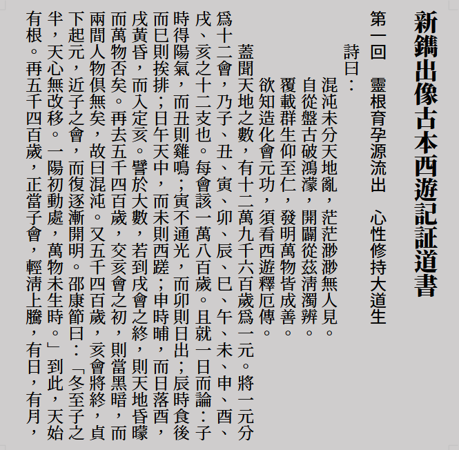
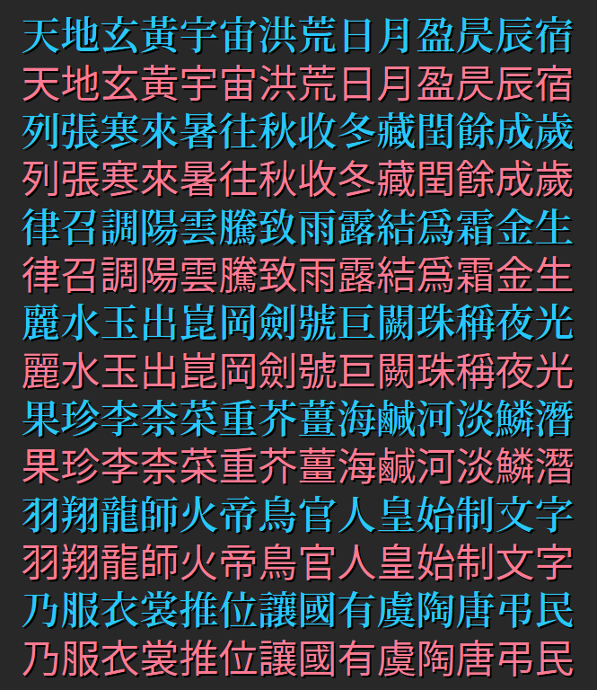
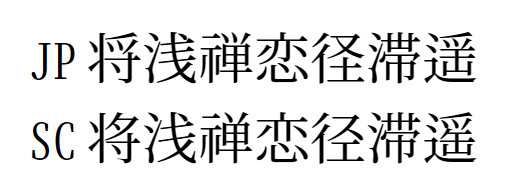
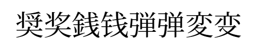
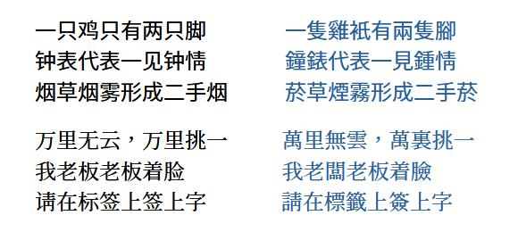

**English** [简体中文](./README-SC.md#shanggu-fonts-尙古字体) [繁體中文](./README-TC.md#shanggu-fonts-尙古字體) [日本語](./README-JA.md#shanggu-fonts-尙古フォントしょうこフォント)

# Shanggu Fonts 尙古字體
A CJK font family series based on the Source Han series with Heritage Glyphs (Old-style).

## 📌 Overview
<b>Shanggu Fonts (尙古字體)</b> is a CJK font family series developed based on [Source Han Sans](https://github.com/adobe-fonts/source-han-sans), [Source Han Serif](https://github.com/adobe-fonts/source-han-serif), and [Source Han Mono](https://github.com/adobe-fonts/source-han-mono). It is an open-source font project centered on the philosophy of **Heritage Glyphs (Old-style)**. The series covers multiple styles including Sans-serif, Serif, and Rounded, and also provides corresponding Simplified-to-Traditional conversion versions.

## 📺 Preview
  
  

## 📝 Naming
The project name is unified as **"Shanggu (尙古)"**. Since "尚" is a common variant of "尙", "尙古" is often written as "尚古". The actual Chinese name adopted for this font series is "尙古", so **please use "尙古" when searching for this font on your computer**.

### 1. 📚 Font Series
 | English | Simplified Chinese | Traditional Chinese | Japanese |
 | :--: | :--: | :--: | :--: |
 | Shanggu Sans | 尙古黑体 | 尙古黑體 | 尙古角ゴシック |
 | Shanggu Serif | 尙古明体 | 尙古明體 | 尙古明朝 |
 | Shanggu Mono | 尙古等宽 | 尙古等寬 | 尙古等幅 |
 | Shanggu Round | 尙古圆体 | 尙古圓體 | 尙古丸ゴシック |

### 2. 📘 Version Descriptions
 | Version | Description |
 | :--: | :--: |
 | (No suffix) | Heritage Glyph Enhanced Edition |
 | TC | Traditional Chinese Punctuation Edition |
 | SC | Simplified Chinese Punctuation Edition |
 | JP | Japanese Punctuation Edition |
 | ST | Simplified-to-Traditional Font |

## 📑 Glyph Standards and Variant Handling
This font does not adopt any specific regional modern glyph standards; instead, it uses more traditional "Heritage Glyphs" as its design basis. It primarily references the [Inherited Glyph Standardization Documents](https://github.com/ichitenfont/inheritedglyphs) by [I.Font Project](https://github.com/ichitenfont). **However, please note that this font does not strictly follow that standard in its entirety.** If you require higher compliance with that standard, it is recommended to use fonts directly produced by I.Font Project.

### 1. 🔶 Heritage Glyph Enhanced Edition (Version without suffix)
The font performs unified processing for common [New and Old variant characters](./main/configs/mulcodechar.dt), adopting the Heritage (Old) glyphs. For example:
- 青 → 靑
- 尚 → 尙
- 兑 → 兌
- 温 → 溫

The Heritage Glyph Enhanced Edition provides one variant version using centered Traditional Chinese punctuation.

### 2. 🌏 Regional Punctuation Editions (TC, SC, JP Versions)
[New and Old variant characters](./main/configs/mulcodechar.dt) are handled according to their respective Unicode encodings without glyph unification.

Based on regional differences in punctuation marks, the font provides three variants:
- **TC** (Traditional Chinese)
- **SC** (Simplified Chinese)
- **JP** (Japanese)

Differences between Chinese and Japanese simplified characters are handled as follows:
- When Chinese and Japanese simplified characters share the same Unicode codepoint, different variants are used to distinguish them.  
  
- When Chinese and Japanese simplified characters reside at different Unicode codepoints, they follow their respective writing conventions without glyph unification.  
  

### 3. 🔁 Automatic Simplified-to-Traditional Font (ST Version)
Features "Simplified Input, Traditional Output" functionality, which dynamically matches "one-to-many" (one simplified character to multiple traditional variants) scenarios based on OpenType features.  
  

## 📦 Font Formats
Multiple formats are provided to suit different usage scenarios.
 | Format | Description |
 | :--: | ---- |
 | OTF / OTC | OpenType CFF native format |
 | TTF / TTC | TrueType format, higher software compatibility |
 | Variable Font | Available in both CFF2 and TrueType variable formats |

## 📥 Download
All font files can be obtained from the project's 👉 [Releases](https://github.com/GuiWonder/Shanggu/releases) page.

## 📜 License
All fonts in this project are licensed under the [SIL Open Font License 1.1 (OFL-1.1)](./LICENSE.txt):
- ✅ **Free to Use**: Both individuals and enterprises can freely download and use the fonts for any commercial design.
- ✅ **Derivatives Permitted**: Modification, extension, and the creation of derivative fonts are allowed under the [OFL-1.1](./LICENSE.txt) terms.
- ⚠️ **Restrictions**: Selling the font files individually is prohibited.

## 🙏 Acknowledgments

### 1. 🔤 Fonts
- [Source Han Sans](https://github.com/adobe-fonts/source-han-sans)
- [Source Han Serif](https://github.com/adobe-fonts/source-han-serif)
- [Source Han Mono](https://github.com/adobe-fonts/source-han-mono)
- [ChiuKong Gothic](https://github.com/ChiuMing-Neko/ChiuKongGothic)

### 2. 🔨 Tools
- [FontTools](https://github.com/fonttools/fonttools)
- [AFDKO](https://github.com/adobe-type-tools/afdko)
- [fontmake](https://github.com/googlefonts/fontmake)
- [otfcc](https://github.com/caryll/otfcc)

### 3. ⚪ Rounded Conversion
- [Resource-Han-Rounded](https://github.com/CyanoHao/Resource-Han-Rounded)

### 4. 📖 References
- [Inherited Glyph Standardization Documents](https://github.com/ichitenfont/inheritedglyphs) / [I.Ming](https://github.com/ichitenfont/I.Ming)
- [zi.tools](https://zi.tools/)
- [OpenCC (Open Chinese Convert)](https://github.com/BYVoid/OpenCC)

## 📬 Contact
- 📩 Email: chunfengfly@outlook.com
