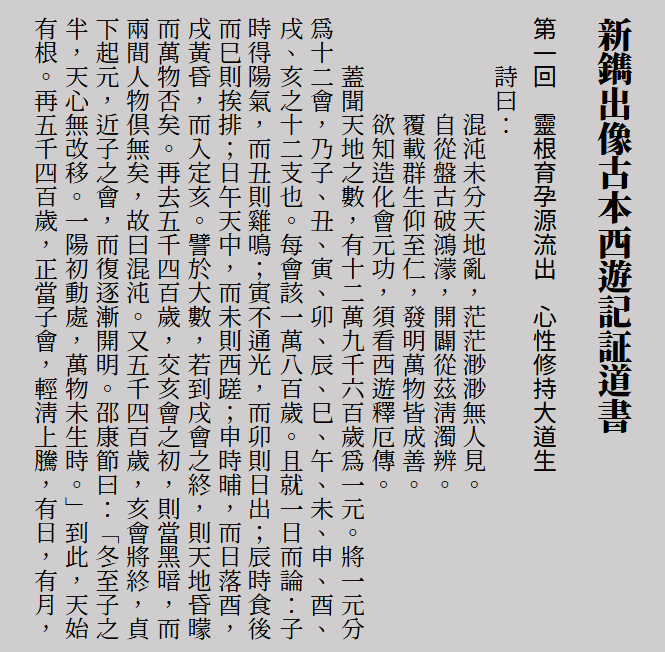
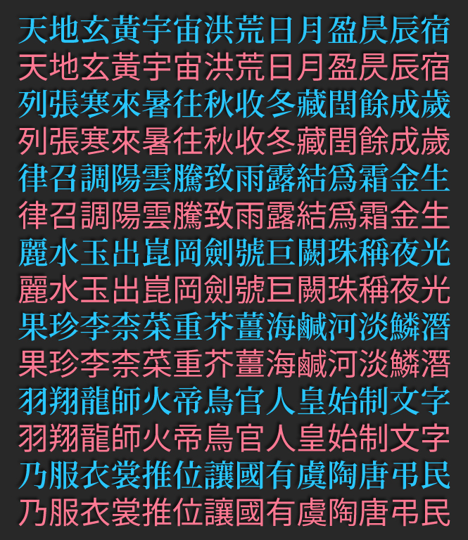

[正體中文](../../#shanggu-fonts) **简体中文**

# Shanggu Fonts
一套泛中日韩字体，基于[思源黑体](https://github.com/adobe-fonts/source-han-sans)、[思源宋体](https://github.com/adobe-fonts/source-han-serif)、[思源等宽](https://github.com/adobe-fonts/source-han-mono)以及思源系列衍生字体制作，包含黑体、明体、圆体以及简转繁字体。

## 预览
  
  
## 关于字体
### 说明
本项目字体名称为“ **尚古 Shanggu Fonts** ”, *旧名称为“ Advocate Ancient Fonts ”*。
#### 1. [新旧异体字](./main/configs/mulcodechar.dt)（如青-靑 尚-尙 兑-兌 温-溫等）合并为旧字形
> Shanggu Sans | 尙古黑体 | 尙古黑體， 
> Shanggu Serif | 尙古明体 | 尙古明體， 
> Shanggu Mono | 尙古等宽 | 尙古等寬。 
#### 2. [新旧异体字](./main/configs/mulcodechar.dt)遵从 Unicode 分开编码
根据标点和简化字的不同，分为TC、SC、JP三种。 
> Shanggu Sans TC | 尙古黑体TC | 尙古黑體TC， 
> Shanggu Serif TC | 尙古明体TC | 尙古明體TC， 
> Shanggu Mono TC | 尙古等宽TC | 尙古等寬TC 
> Shanggu Sans SC | 尙古黑体SC | 尙古黑體SC， 
> Shanggu Serif SC | 尙古明体SC | 尙古明體SC， 
> Shanggu Mono SC | 尙古等宽SC | 尙古等寬SC， 
> Shanggu Sans JP | 尙古黑体JP | 尙古黑體JP， 
> Shanggu Serif JP | 尙古明体JP | 尙古明體JP， 
> Shanggu Mono JP | 尙古等宽JP | 尙古等寬JP。 
#### 3. 简转繁体
简入繁出的字体，可根据文本内容动态匹配一简多繁的情况。
> Shanggu Sans ST | 尙古黑体 转繁体 | 尙古黑體 轉繁體， 
> Shanggu Serif ST | 尙古明体 转繁体 | 尙古明體 轉繁體。 

▼ 一简多繁测试，此功能使用 OpenType 特性。 
  

### 格式说明
#### 1. OpenType 格式(OTF/OTC)
原版格式。
#### 2. TrueType 格式(TTF/TTC)
基于 [Source-Han-TrueType](https://github.com/Pal3love/Source-Han-TrueType) 无损转换，兼容性较好。
#### 3. 可变字体
包括 OpenType 和 TrueType 格式。*由于资源限制，此版本未使用旧版思源黑体、思源宋体的字图。*

## 下载字体
1. 可从本站 [Releases](../../releases) 页面下载字体（推荐）。
2. 可从[腾讯微云](https://share.weiyun.com/VEoOc5xK)下载 Shanggu 字体。
## 授权
遵循 [SIL Open Font License 1.1](./LICENSE.txt)。

## 特别感谢
#### 1. 字图来源
- [思源黑体](https://github.com/adobe-fonts/source-han-sans)
- [思源宋体](https://github.com/adobe-fonts/source-han-serif)
- [思源等宽](https://github.com/adobe-fonts/source-han-mono)
- [秋空󠄁黑体](https://github.com/ChiuMing-Neko/ChiuKongGothic)
#### 2. 字体处理工具
- [FontTools](https://github.com/fonttools/fonttools)
- [AFDKO](https://github.com/adobe-type-tools/afdko/)
- [otfcc](https://github.com/caryll/otfcc)
#### 3. TrueType 格式转换及处理
- [Source-Han-TrueType](https://github.com/Pal3love/Source-Han-TrueType)
- [Source Han Sans TTF](https://github.com/be5invis/source-han-sans-ttf)
- [Resource-Han-Rounded](https://github.com/CyanoHao/Resource-Han-Rounded)
#### 4. 字形参考
- [传承字形标准化文件](https://github.com/ichitenfont/inheritedglyphs) [I.明体](https://github.com/ichitenfont/I.Ming)
- [zi.tools 字統网](https://zi.tools/)
- [字形维基(GlyphWiki)](https://glyphwiki.org/)
#### 5. 简转繁参考
- [OpenCC 开放中文转换](https://github.com/BYVoid/OpenCC)
- [《正确实现简转繁字体》](https://ayaka.shn.hk/s2tfont/)
## 关于作者
- **Email：** chunfengfly@outlook.com

