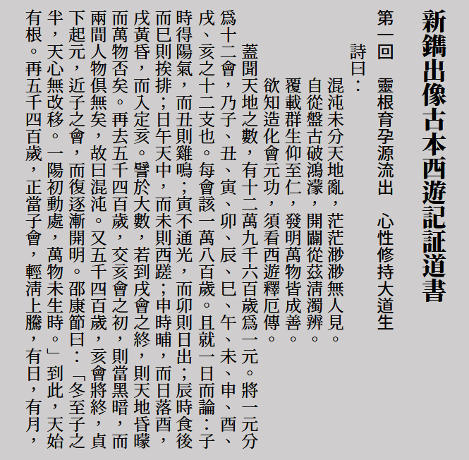
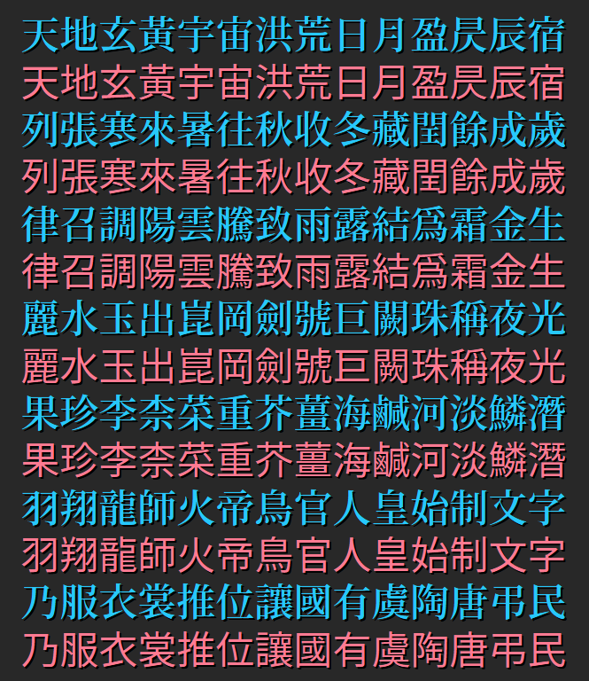
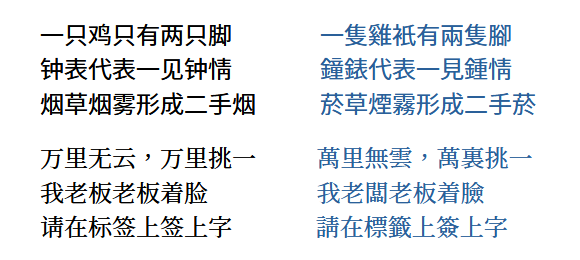

**正體中文** [简体中文](./README-SC.md#shanggu-fonts)

# Shanggu Fonts
一套泛中日韓字型，基於[思源黑體](https://github.com/adobe-fonts/source-han-sans)、[思源宋體](https://github.com/adobe-fonts/source-han-serif)、[思源等寬](https://github.com/adobe-fonts/source-han-mono)以及思源系列衍生字型製作，包含黑體、明體、圓體以及簡轉繁字型。

## 預覽
  
  
## 關於字型
### 說明
本專案字型名稱為「 **尚古 Shanggu Fonts** 」*或「尙古 Advocate Ancient Fonts 」*。
#### 1. [新舊異體字](./main/configs/mulcodechar.dt)（如青-靑 尚-尙 兑-兌 温-溫等）合併為舊字形
> Shanggu Sans | 尙古黑体 | 尙古黑體， 
> Shanggu Serif | 尙古明体 | 尙古明體， 
> Shanggu Mono | 尙古等宽 | 尙古等寬。 
#### 2. [新舊異體字](./main/configs/mulcodechar.dt)遵從 Unicode 分開編碼
根據地區標點和簡化字的不同，分為TC、SC、JP三種。 
> Shanggu Sans TC | 尙古黑体TC | 尙古黑體TC， 
> Shanggu Serif TC | 尙古明体TC | 尙古明體TC， 
> Shanggu Mono TC | 尙古等宽TC | 尙古等寬TC 
> Shanggu Sans SC | 尙古黑体SC | 尙古黑體SC， 
> Shanggu Serif SC | 尙古明体SC | 尙古明體SC， 
> Shanggu Mono SC | 尙古等宽SC | 尙古等寬SC， 
> Shanggu Sans JP | 尙古黑体JP | 尙古黑體JP， 
> Shanggu Serif JP | 尙古明体JP | 尙古明體JP， 
> Shanggu Mono JP | 尙古等宽JP | 尙古等寬JP。 
> 
> NOTE: 字型名稱中的 TC、SC、JP 僅代表地區標點的不同，本字型不使用地區的字形標準。
#### 3. 簡轉繁體
簡入繁出的字型，可根據文字内容動態匹配一簡多繁的情況。
> Shanggu Sans ST | 尙古黑体 转繁体 | 尙古黑體 轉繁體， 
> Shanggu Serif ST | 尙古明体 转繁体 | 尙古明體 轉繁體。 

▼ 一簡多繁測試，此功能使用 OpenType 特性。 
  

### 格式說明
#### 1. OpenType 格式(OTF/OTC)
原版格式。
#### 2. TrueType 格式(TTF/TTC)
基於 [Source-Han-TrueType](https://github.com/Pal3love/Source-Han-TrueType)，具有良好的兼容性。
#### 3. 可變字型
包括 OpenType 和 TrueType 格式。

## 下載字型
1. 可從本站 [Releases](https://github.com/GuiWonder/Shanggu/releases) 頁面下載字型（推薦）。
2. 可從[騰訊微雲](https://share.weiyun.com/VEoOc5xK)下載 Shanggu 字型。
## 授權
遵循 [SIL Open Font License 1.1](./LICENSE.txt)。

## 特別感謝
#### 1. 字型
- [思源黑體](https://github.com/adobe-fonts/source-han-sans)
- [思源宋體](https://github.com/adobe-fonts/source-han-serif)
- [思源等寬](https://github.com/adobe-fonts/source-han-mono)
- [秋空󠄁黑體](https://github.com/ChiuMing-Neko/ChiuKongGothic)
#### 2. 字型處理工具
- [FontTools](https://github.com/fonttools/fonttools)
- [AFDKO](https://github.com/adobe-type-tools/afdko/)
- [otfcc](https://github.com/caryll/otfcc)
#### 3. TrueType 格式轉換及處理
- [Source-Han-TrueType](https://github.com/Pal3love/Source-Han-TrueType)
- [Source Han Sans TTF](https://github.com/be5invis/source-han-sans-ttf)
- [Resource-Han-Rounded](https://github.com/CyanoHao/Resource-Han-Rounded)
#### 4. 字形參考
- [傳承字形標準化文件](https://github.com/ichitenfont/inheritedglyphs) [I.明體](https://github.com/ichitenfont/I.Ming)
- [zi.tools 字統网](https://zi.tools/)
- [字形維基(GlyphWiki)](https://glyphwiki.org/)
#### 5. 簡轉繁參考
- [OpenCC 開放中文轉換](https://github.com/BYVoid/OpenCC)
- [《正確實現簡轉繁字型》](https://ayaka.shn.hk/s2tfont/hant/)
## 關於作者
- **Email：** chunfengfly@outlook.com

