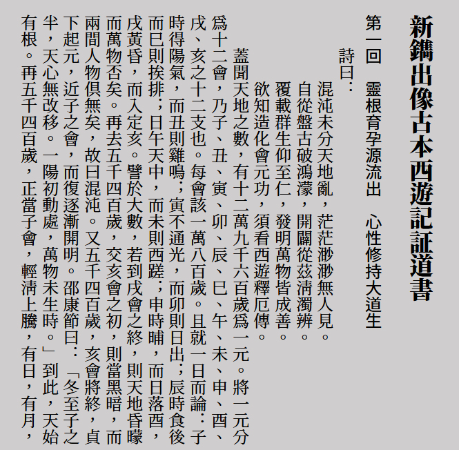
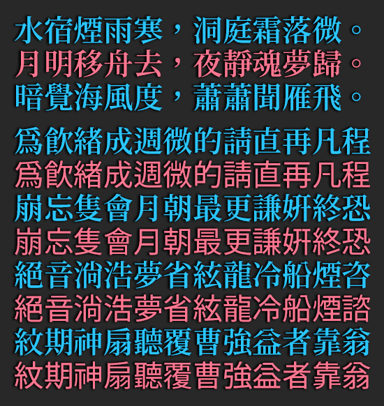

**繁體中文** [简体中文](README-SC.md#思源中文字体转为传承字形)
# 思源中文字型轉為傳承字形
* [思源中文字型](https://github.com/adobe-fonts)（使用日版）轉為傳承字形（舊字形），思源黑體、思源宋體、思源等寬均可用 。

## 預覽
  
  
與舊報紙對比 
 
 
## 關於字型名稱：
當前字型命名為「 **尚古 Advocate Ancient Fonts** 」，共 8 套，每套 7 種粗細，字型名稱如下： 
**Advocate Ancient Sans | 尙古黑体 | 尙古黑體 | 尙古黑體 香港， 
Advocate Ancient Serif | 尙古明体 | 尙古明體 | 尙古明體 香港， 
Advocate Ancient Mono | 尙古等宽 | 尙古等寬 | 尙古等寬 香港 
Advocate Ancient Sans ST | 尙古黑體-轉繁體， 
Advocate Ancient Serif ST | 尙古明體-轉繁體。 
Advocate Ancient Sans SC | 尙古黑体SC | 尙古黑體SC， 
Advocate Ancient Serif SC | 尙古明体SC | 尙古明體SC， 
Advocate Ancient Mono SC | 尙古等宽SC | 尙古等寬SC。  **
*註1：SC版為多編碼漢字分開編碼的版本。* 
*註2：「轉繁體」中，由於詞彙佔用一部分字形空間，因此需要移除一部分字形，所顯示的字元數目要少一些（約一萬八千字元）。*

## 下載字型
1. 可從本站 [Releases](https://github.com/GuiWonder/SourceHanToClassic/releases) 頁面下載字型。
2. 可從[騰訊微雲](https://share.weiyun.com/VEoOc5xK)下載 AdvocateAncient 系列字型。

## 使用工具生成字型
### 1. 執行命令
執行命令`python sourcehantocl.py`
* 選項1：是否合併多個編碼的漢字，例如：青-靑 尚-尙 兑-兌 温-溫等？，輸入Y/N
* 選項2：標點選擇：1.日本 2.簡體中文 3.正體中文（居中）
* 選項3：簡化字字形選擇：1.日本 2.中國大陸
* 選項4：是否移除未使用的字形，輸入Y/N
* 選項5：設定字型名稱：~1.使用思源原版字型名稱~ 2.使用尙古黑體、尙古明體 3.我來命名
* 選項6*：字型的英文名稱
* 選項7*：字型的中文名稱
### 2. 執行帶引數命令
將輸入輸出檔案與上述選項作為引數執行，例如：  
`python sourcehantocl.py SourceHanSans-Regular.otf AdvocateAncientSans-Regular.otf y 3 2 y 2` 
`python sourcehantocl.py SourceHanSans-Regular.otf MyFont-Regular.otf y 3 2 y 3 MyFont 新名稱`

## 特別感謝
* [Adobe Fonts](https://github.com/adobe-fonts) [思源黑體](https://github.com/adobe-fonts/source-han-sans) [思源宋體](https://github.com/adobe-fonts/source-han-serif) [思源等寬](https://github.com/adobe-fonts/source-han-mono)
* [otfcc](https://github.com/caryll/otfcc)
* [I.字坊](https://github.com/ichitenfont)的[傳承字形標準化檔案](https://github.com/ichitenfont/inheritedglyphs)及[I.明體](https://github.com/ichitenfont/I.Ming)
* [Open Chinese Convert](https://github.com/BYVoid/OpenCC) 
* [《正確實現簡轉繁字型》](https://ayaka.shn.hk/s2tfont/hant/)

## 關於作者
- **Email：** chunfengfly@outlook.com
